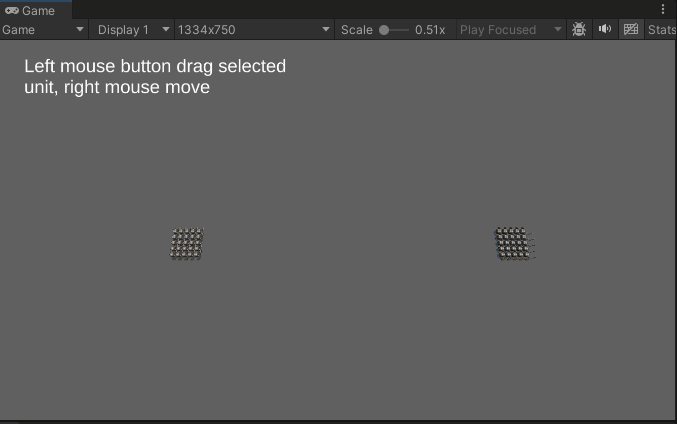

# URPLearn

## 介绍
Unity URP学习项目

### BatchRendererGroupTest
BatchRendererGroup+Animation Texture+JobSystem+RVO大批量角色渲染

### RVO2Examples

### Boid模拟
根据 https://github.com/SebLague/Boids 提供的教程学习Boid模拟

### RenderObjectsRendererFeatureSample
根据官方文档制作, 物体被遮挡后以另一个Shader方式显示

https://docs.unity3d.com/Packages/com.unity.render-pipelines.universal@17.0/manual/containers/how-to-custom-effect-render-objects.html
### ProceduralAnimation
根据教程学习程序化动画

https://weaverdev.io/projects/bonehead-procedural-animation
### PathFinding
几种寻路算法的学习和实现
### ComputeShader 
使用ComputeShader简单输出颜色到一个RenderTexture上
### UVSequenceFrameAnimation
shader的UV序列帧动画