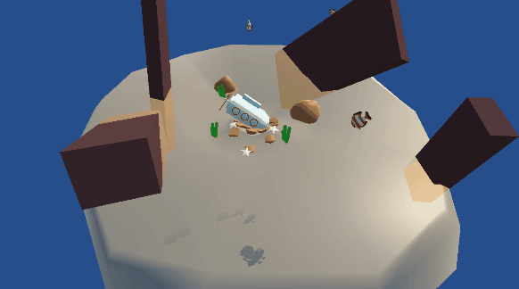
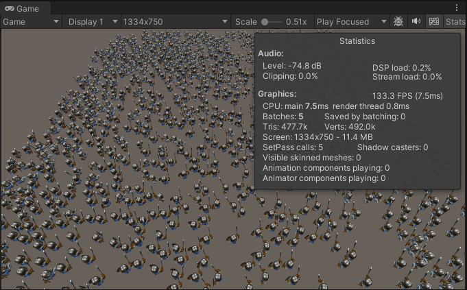
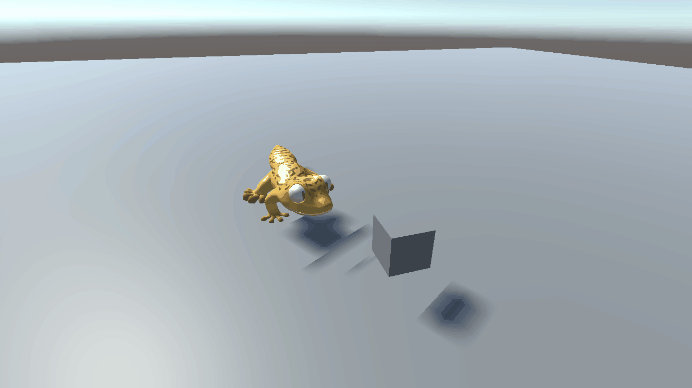
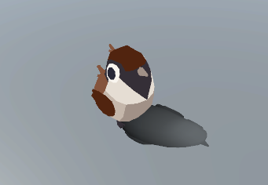

# UnityPractice
Unity学习项目

## BoidECS
使用Entities加Job的Boid群体行为算法, 模拟鱼群效果

## BatchRendererGroupTest
BatchRendererGroup+Animation Texture+JobSystem+RVO大批量角色渲染

## ProceduralAnimation
程序化动画，由TwoBone IK解算的反向动力学控制四肢骨骼的位置和旋转，再另外单独控制四肢IK目标
https://weaverdev.io/projects/bonehead-procedural-animation

## PathFinding
几种寻路算法AStar,Dijkstra,VectorField的学习和实现

## Planar Shadow

## ComputeShader 
使用ComputeShader简单输出颜色到一个RenderTexture上
## UVSequenceFrameAnimation
shader的UV序列帧动画
## RenderObjectsRendererFeatureSample
根据官方文档制作, 物体被遮挡后以另一个Shader方式显示
